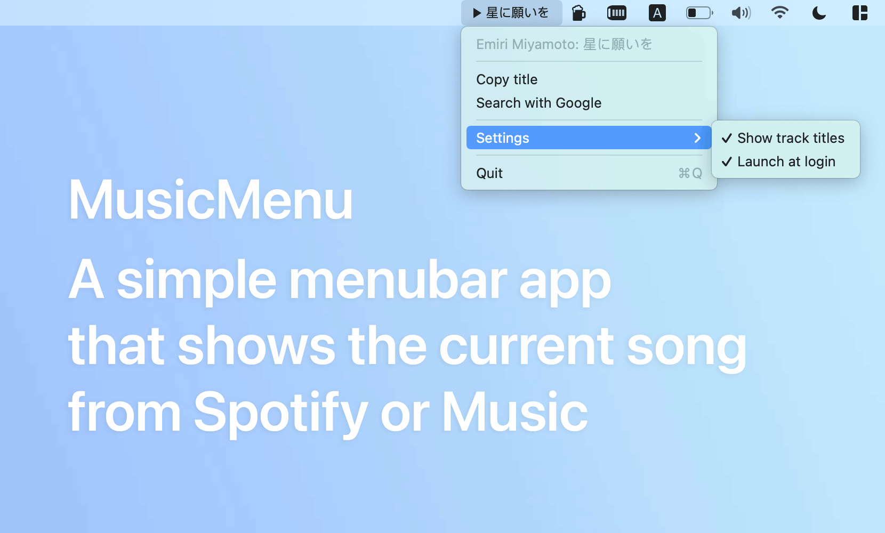

## MusicMenu

This a simple menubar app to show the now playing track of the Spotify or Music. With a quick ability to copy the name of the track and find it in Google.

## Install

### Manually
Download from the [Releases](https://github.com/nyok/MusicMenu/releases) page.

## Language: 
- English
- Russian

## License
Autostart package used from [LaunchAtLogin](https://github.com/sindresorhus/LaunchAtLogin)

Icon is [Material design icons is the official icon set from Google](https://github.com/google/material-design-icons/)